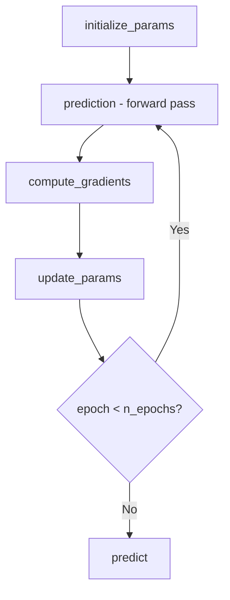

# Linear Regression From Scratch (NumPy Only)

A fully functional implementation of Linear Regression built from scratch
using only NumPy — no sklearn for the model itself. This project demonstrates
the math and code behind linear regression, from gradient descent to final
predictions.

---

## Why Build From Scratch?

Using `sklearn.LinearRegression()` is great for production, but building it
yourself gives you:
- Deep understanding of how gradient descent works
- Confidence to debug model issues
- Foundation to understand neural networks (same building blocks!)

---

## How It Differs from Logistic Regression

| | Logistic Regression | Linear Regression |
|---|---|---|
| **Output** | Probability via `sigmoid` | Raw continuous number |
| **Loss Function** | Binary Cross-Entropy | Mean Squared Error (MSE) |
| **Prediction** | Class label (0 or 1) | Continuous value |
| **Use Case** | Classification | Regression |

---

## Math Behind the Model

### 1. Prediction
No activation function — the raw dot product is the output:

```math
\hat{y} = X \cdot W + b
```

### 2. Mean Squared Error Loss
Measures average squared difference between predicted and actual values:

```math
L = \frac{1}{n} \sum (\hat{y} - y)^2
```

### 3. Gradients (Backpropagation)
How much each parameter contributed to the error:

```math
\frac{\partial L}{\partial W} = \frac{2}{n} X^T \cdot (\hat{y} - y)
```

```math
\frac{\partial L}{\partial b} = \frac{2}{n} \sum (\hat{y} - y)
```

### 4. Gradient Descent (Parameter Update)
Nudge parameters in the direction that reduces loss:

```math
W = W - \alpha \cdot dW
```

```math
b = b - \alpha \cdot db
```

where $\alpha$ is the **learning rate**.

---

## Code Structure


---

## Key Concepts to Remember

| Concept | What It Does |
|---|---|
| MSE Loss | Penalizes larger errors more heavily due to squaring |
| Forward Pass | Computes predictions from current W and b |
| Gradients | Tell us which direction to move W and b |
| Learning Rate | Controls how big each update step is |
| Gradient Descent | Iteratively reduces loss by updating params |
| R² Score | Measures how well model explains variance (1.0 = perfect) |

---


## Evaluation Metrics

| Metric | Formula | Ideal Value |
|---|---|---|
| MSE | $\frac{1}{n}\sum(\hat{y} - y)^2$ | As low as possible |
| R² | $1 - \frac{\sum(\hat{y}-y)^2}{\sum(\bar{y}-y)^2}$ | Close to 1.0 |

---

## Acknowledgement

Built step by step as a learning exercise to understand the internals of
Linear Regression before using high-level libraries.
