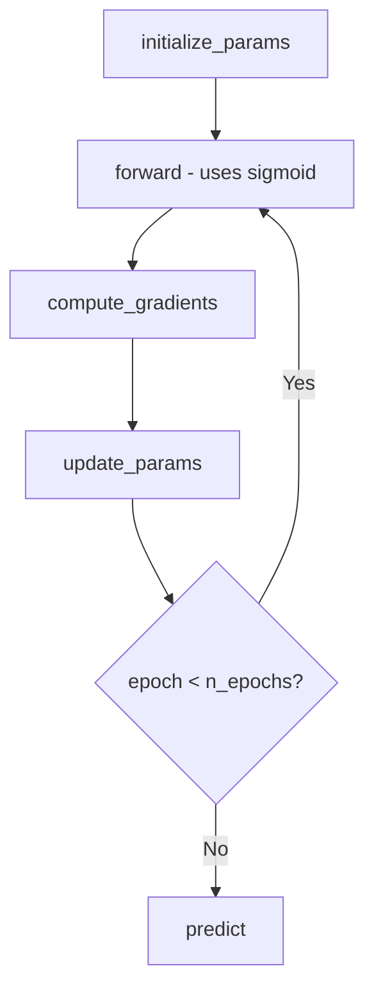

```markdown
# Logistic Regression From Scratch (NumPy Only)

A fully functional implementation of Logistic Regression built from scratch
using only NumPy — no sklearn for the model itself. This project is ideal for
anyone who wants to understand the math and code behind logistic regression
rather than just calling a library function.

---

## Why Build From Scratch?

Using `sklearn.LogisticRegression()` is great for production, but building it
yourself gives you:
- Deep understanding of how gradient descent works
- Confidence to debug model issues
- Foundation to learn neural networks (same building blocks!)

---

## Math Behind the Model

### 1. Sigmoid Function
Converts any real number into a probability between 0 and 1:

$$\sigma(z) = \frac{1}{1 + e^{-z}}$$

### 2. Prediction
$$\hat{y} = \sigma(X \cdot W + b)$$

### 3. Binary Cross-Entropy Loss
Measures how wrong the model's predictions are:

$$L = -\frac{1}{n} \sum \left[ y \log(\hat{y}) + (1 - y) \log(1 - \hat{y}) \right]$$

### 4. Gradients (Backpropagation)
How much each parameter contributed to the error:

$$\frac{\partial L}{\partial W} = \frac{1}{n} X^T \cdot (\hat{y} - y)$$

$$\frac{\partial L}{\partial b} = \frac{1}{n} \sum (\hat{y} - y)$$

### 5. Gradient Descent (Parameter Update)
Nudge parameters in the direction that reduces loss:

$$W = W - \alpha \cdot dW$$
$$b = b - \alpha \cdot db$$

where $\alpha$ is the **learning rate**.

---

## Code Structure

```


```

---

## Key Concepts to Remember

| Concept | What It Does |
|---|---|
| Sigmoid | Maps predictions to probability (0–1) |
| Cross-Entropy Loss | Penalizes wrong confident predictions |
| Forward Pass | Computes predictions from current W and b |
| Gradients | Tell us which direction to move W and b |
| Learning Rate | Controls how big each update step is |
| Gradient Descent | Iteratively reduces loss by updating params |

---

## Common Pitfalls & Fixes

- **Loss going up instead of down** → Learning rate is too high, try `lr=0.01`
- **`ValueError: truth value of array is ambiguous`** → Don't use `if` on numpy
  arrays, use vectorized operations instead
- **`log(0)` returning `-inf`** → Clip predictions:
  `y_hat = np.clip(y_hat, 1e-8, 1 - 1e-8)`
- **Forgetting to scale features** → Always use `StandardScaler` before
  training with gradient descent

---

## Requirements

```
numpy
scikit-learn  # only for dataset loading and benchmarking

